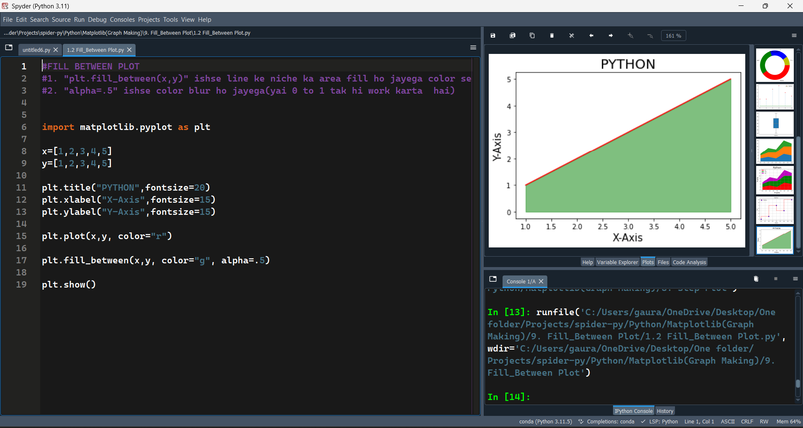
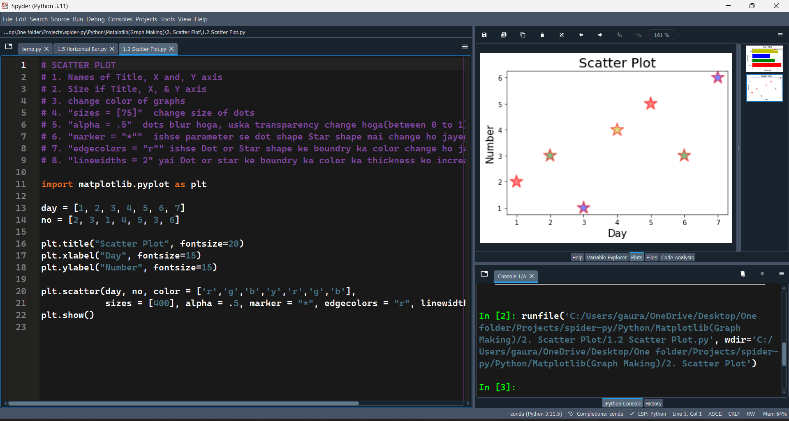
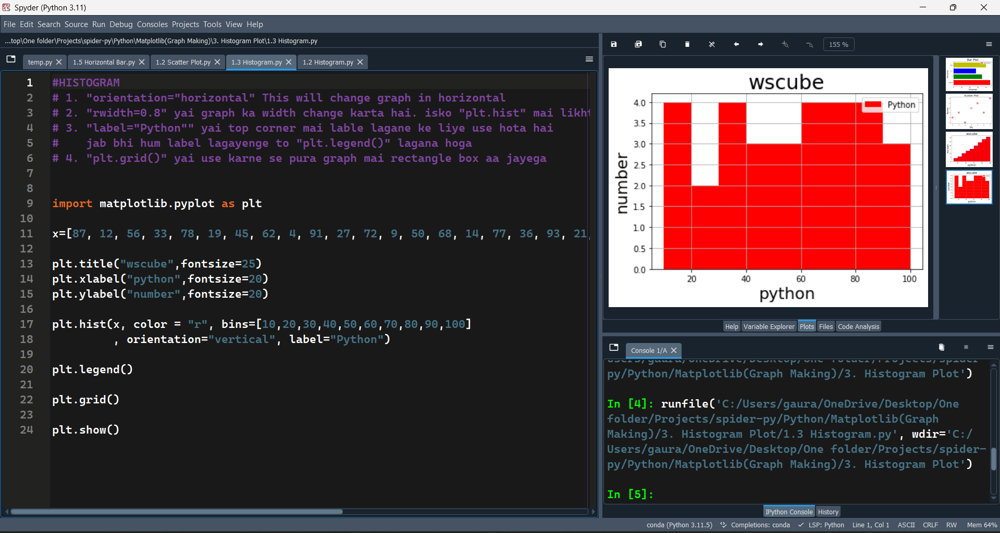
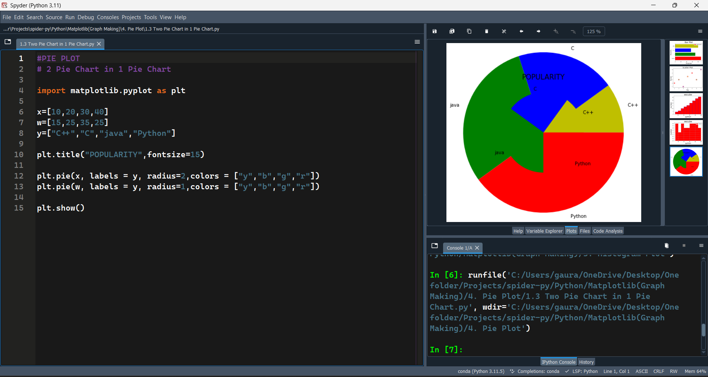
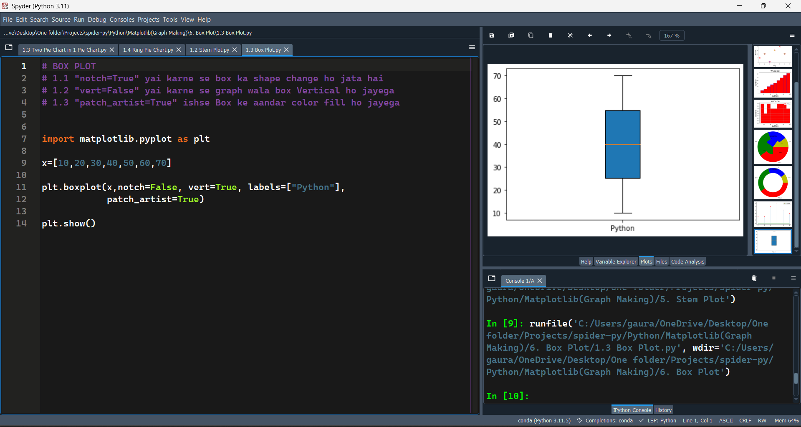
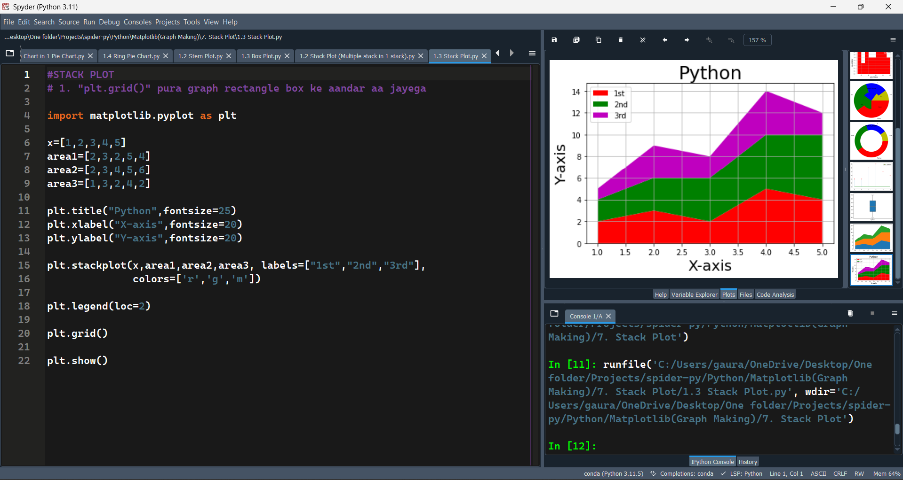
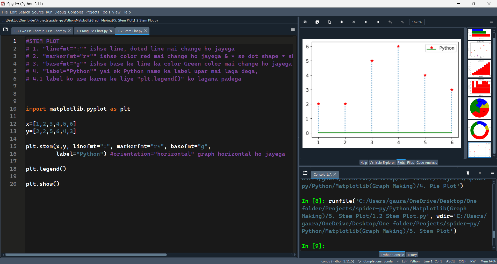
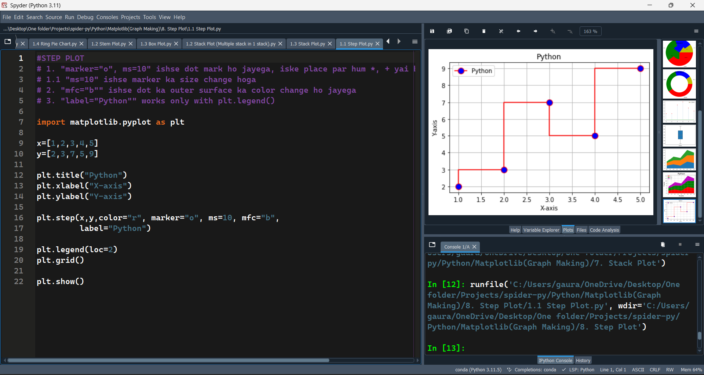
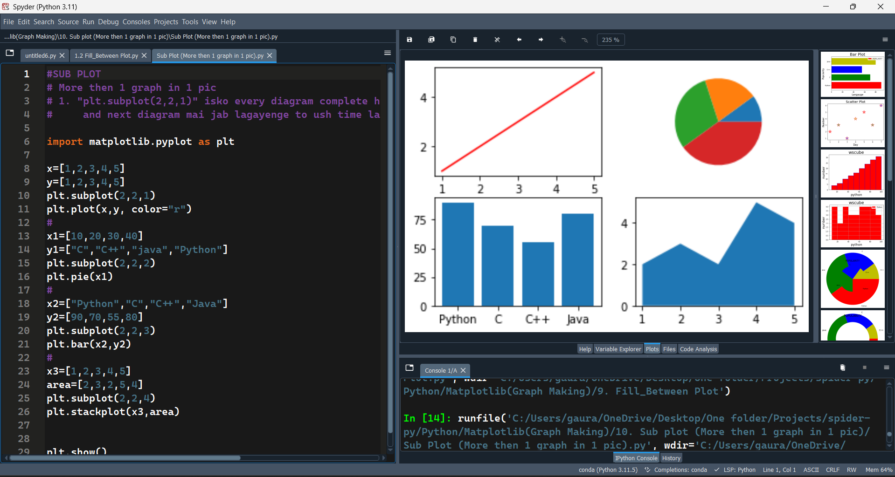

# Python Data Visualization 

This repository contains Python scripts that demonstrate different types of plots using **Matplotlib**.  
Each folder includes code examples, and the `Pic/` folder contains sample output images of the plots.

---

## Project Structure
- `1. Bar Plot/` → Bar chart examples
- `2. Scatter Plot/` → Scatter plot examples
- `3. Histogram Plot/` → Histogram examples
- `4. Pie Plot/` → Pie chart examples
- `5. Stem Plot/` → Stem plot examples
- `6. Box Plot/` → Box plot examples
- `7. Stack Plot/` → Stack plot examples
- `8. Step Plot/` → Step plot examples
- `9. Fill_Between Plot/` → Fill-between examples
- `10. Sub Plot/` → Multiple plots in one figure
- `Pic/` → Sample images of generated plots

---

## 📊 Example Plots

### 🔹 Fill Plot


### 🔹 Scatter Plot


### 🔹 Histogram


### 🔹 Pie Chart


### 🔹 Box Plot


### 🔹 Stack Plot -----------


### 🔹 Stem Plot


### 🔹 Step Plot


### 🔹 Sub Plot



## 🚀 How to Run
1. Clone this repo:
   ```bash
   git clone https://github.com/your-username/Python-Data-Visualization.git
